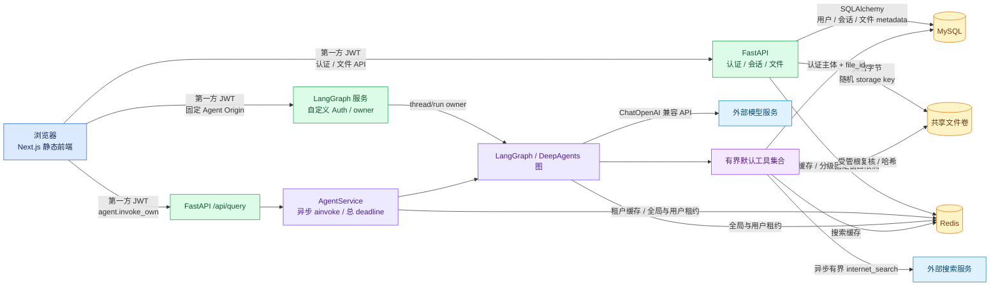

# Deep Data Agent 项目分析

> 状态日期：2026-08-21
> 审计执行日期：2026-08-12
> 审计基线：`main` @ `f6cf4e65d8b15114fc164fd6921bd65d6ad27862`

## 1. 范围与证据

### 1.1 审计范围

本报告以仓库真实可达调用链为边界，覆盖浏览器、Next.js 静态前端、FastAPI、
LangGraph/DeepAgents、MySQL、Redis、模型与工具调用、Docker Compose、GitHub
Actions、迁移、认证授权、可观测性和发布契约。`utils/` 作为受跟踪遗留模块接受
可达性检查；静态导入搜索未发现主应用、测试、脚本、Compose 或工作流导入它，
因此其内部问题不计入 18 个主应用问题，归属处置统一进入 `DEC-005`。

报告使用以下状态词，彼此不可替换：

| 状态 | 含义 |
|---|---|
| **已实现** | 当前基线代码或配置中存在该能力；不自动代表本轮运行成功。 |
| **已验证** | 在明确的审计基线或当前工作树上实际执行检查并取得通过结果；本地与 Hosted 证据分别标注。 |
| **未验证** | 本轮没有取得运行证据，不能用代码存在、静态解析或历史结果代替。 |
| **候选** | 审计建议、开放决策或后续路线，不是当前已经交付的能力。 |

### 1.2 锁定基线与当前工作树

| 项目 | 审计与当前工作树证据 |
|---|---|
| 日期与版本 | 2026-08-12，分支 `main`，完整 HEAD `f6cf4e65d8b15114fc164fd6921bd65d6ad27862`。审计开始前该已推送 HEAD 的工作区干净。 |
| 交付前复核 | 2026-08-16 在同一运行时代码基线上重跑后端、前端、发布契约、Compose 解析与差异检查；两名新的独立验证者逐项确认全部 18 个最终问题，结论仍为 18/18 均 2/2 高置信度。复核只收紧证据边界，不改变严重度、问题数或 Roadmap 映射。 |
| 审计收口工作区 | 审计收口只修改 5 个治理文档及 `.trae/specs/audit-project-roadmap/`，没有运行时代码、测试、依赖或配置改动。该记录描述历史审计收口，不是当前工作树状态。 |
| 当前工作树 | `bound-agent-resource-use` 已完成本地实现与验证：统一 Agent/模型/工具预算，增加 Redis 双层并发租约和自动恢复，拆分 liveness/readiness，并删除运行时任意 Python 执行能力；治理文档同步完成，远端验证待提交后执行。 |
| Roadmap 状态 | 既有 10 个已完成 change-id，加上本地完成、远端待验证的 `bound-agent-resource-use`，共 11 个已完成或本地完成项；余下 8 个候选，下一候选为 `prove-data-recovery`。 |
| 后端本地证据 | Python 3.12.9；`pytest -q` 共 **452 项通过**，`tests/test_migrations.py` 定向测试 **8 项通过**，release contract pytest **159 项通过**；isort、发布契约脚本、Alembic 唯一 head、Compose 和 `git diff --check` 通过。 |
| 前端本地证据 | Node.js `v22.22.2` 与 pnpm `10.5.1` 的 `typecheck`、零警告 `lint`、`format:check`、`build` 全部通过。 |
| 前端版本边界 | `agent_chatui/package.json` 支持 Node [`>=22.11.0 <23`](../../agent_chatui/package.json#L10-L14) 与 pnpm `10.5.1`。本机默认 Node.js 25.2.1 不在支持范围，本轮发布证据来自明确选择的 Node.js 22.22.2；历史 Hosted Frontend Job 只证明审计目标 SHA 的 Node 22 门禁。 |
| 本地容器证据 | Docker Engine 29.4.1、Docker Desktop 4.71.0、Compose 5.1.3；当前源码五服务 empty、head、legacy 场景与 Redis stop/start canary 全部通过。canary 证明 Redis 停止时 live 为 200、ready 为 503、Agent fail-closed，恢复后后端不重启即重新 ready。 |
| 外部调用与清理 | 容器验收只使用专用假配置、脱敏 canary 和不可外连模型地址；模型/搜索调用均为 0，未使用生产数据。容器、网络、卷、临时配置及生成物已完整清理。 |
| 本轮远端证据 | 当前 change-id 尚未提交，远端验证待后续执行；不得把历史 change-id 的远端结果外推到本轮，也不记录当前实现提交或运行标识。 |
| 明确缺口 | 未执行真实模型/搜索/业务数据调用、完整浏览器 E2E、生产备份恢复或容量压测；受管文件卷仍受 `RR-001` 约束。`AUD-006` 的可重复供应链、`AUD-007` 的未知 schema fail-closed 和 `langgraph-api 0.7.28` EOL 未由本轮关闭。 |

### 1.3 共识方法与严重度

Task 3 对候选发现执行两名独立验证者复核。本报告只保留双方均确认的
**18 个 2/2 高置信度问题**：

- **P0**：可直接造成凭据/数据泄露、跨用户访问、不可恢复数据损失或发布阻断。
- **P1**：高概率造成安全边界失效、重大不一致或生产不可用。
- **P2**：限制可维护性、可恢复性、扩展性或业务迭代，但存在受控绕行。
- **P3**：低风险改进或文档/体验缺口，不应阻塞更高优先级工作。

审计最终裁决为 **4 个 P0、3 个 P1、10 个 P2、1 个 P3**。存在性仍为 18 个
2/2 高置信度问题；严重度由本 Spec 定义最终裁决，不反写验证者原始的 P1/P2
建议。去重结果为：`AUD-013` 合并到 `AUD-010`，`AUD-021` 合并到 `AUD-006`；
`AUD-019` 为 0/2，不进入问题与路线判断。完整 21 候选 × 2 验证者矩阵见第 4.5 节。
当前工作树关闭 `AUD-014`、`AUD-011`、`AUD-015`、`AUD-001`、`AUD-003`、
`AUD-002`、`AUD-005`、`AUD-004`、`AUD-008`、`AUD-009`；历史审计记录不删除，
当前开放项为 **8 个：0 P0、1 P1、6 P2、1 P3**。
其余问题中的修复方案仍为**候选**，
不应解读为已实现或已验证。

### 1.4 已审查且无独立问题的范围

以下范围已读取创建、调用和门禁上下文；它们不新增最终审计 ID，但其成立的风险
已经并入对应问题或风险接受：

- **代码执行历史边界**：历史工具使用本机临时文件与子进程，30 秒 timeout 不是
  CPU、内存、网络或文件系统沙箱，因此资源问题并入 `AUD-004`、启用风险并入
  `RR-004`，未另立“临时文件未清理”问题。当前工作树已删除该工具文件、公共配置、
  Compose 传递、提示和注册路径；残留 `ENABLE_CODE_EXECUTION` 不会恢复能力。
  `AUD-004` 与 `RR-004` 的当前运行时边界据此收口，未来恢复必须新建独立沙箱
  change-id。
- **实验图表路径**：`AutoChart` 当前只由
  [`src/app/test-chart/page.tsx`](../../agent_chatui/src/app/test-chart/page.tsx#L1-L83)
  这个测试页面导入；组件本身位于
  [`src/components/ui/ant-charts.tsx`](../../agent_chatui/src/components/ui/ant-charts.tsx#L1-L92)。
  主对话、上传和报告调用链未导入该组件，故当前只能认定为实验路径，不能把图表/
  报告写成已交付产品能力，也不形成独立问题。
- **静态导出与公开 URL**：生产构建在
  [`next.config.mjs`](../../agent_chatui/next.config.mjs#L1-L20) 启用静态导出及
  `/data_copilot` base path；浏览器端
  [`src/config/index.ts`](../../agent_chatui/src/config/index.ts#L1-L14) 读取
  `NEXT_PUBLIC_API_URL`、`NEXT_PUBLIC_ASSISTANT_ID` 和
  `NEXT_PUBLIC_REST_API_URL`。这些值按 Next.js 契约会进入公开静态产物，只能承载
  公开地址/标识，不能承载 Secret；现有独立风险已由 `AUD-003` 的可变 Agent
  Origin/Key 边界覆盖。
- **`utils/` 门禁边界**：静态导入搜索未发现主应用、测试、脚本、Compose 或 CI
  导入仓库根 `utils` 包。发布契约把整个 `utils/` 纳入凭据内容扫描：
  [scripts/check_release_contracts.py:L21-L65](../../scripts/check_release_contracts.py#L21-L65)，
  并对所有受跟踪路径（含 `utils/`）检查生成物：
  [scripts/check_release_contracts.py:L350-L366](../../scripts/check_release_contracts.py#L350-L366)、
  [scripts/check_release_contracts.py:L552-L558](../../scripts/check_release_contracts.py#L552-L558)。
  但主应用 CI 只安装根
  [`requirements.txt`](../../.github/workflows/release-readiness.yml#L30-L40)，
  后端镜像也只安装根依赖：
  [data_agent/Dockerfile:L10-L14](../../data_agent/Dockerfile#L10-L14)；均不安装
  `utils/requirements.txt`，也不运行 `utils/` 独立测试。因此它受凭据/生成物卫生
  扫描，却不受主应用依赖安装和测试门禁，后续归属仍由 `DEC-005` 决定。

## 2. 当前架构

### 2.1 真实调用链与认证边界

下图描述当前工作树。浏览器对第一方 REST 与 LangGraph 使用同一 JWT，但只向两个
固定构建 Origin 发送；FastAPI `/api/query` 与 LangGraph thread/run 均要求第一方
主体。所有强调节点的样式同时定义 `fill` 与 `color`。

可核对的装配点：

- FastAPI 注册 CORS、限流、观测中间件及认证/会话/管理路由，并提供分层健康端点：
  [data_agent/agent_server.py:L47-L72](../../data_agent/agent_server.py#L47-L72)、
  [data_agent/agent_server.py:L217-L233](../../data_agent/agent_server.py#L217-L233)。
- 第一方会话与管理路由通过数据库读取当前角色并执行默认拒绝权限：
  [data_agent/routes/session.py:L71-L100](../../data_agent/routes/session.py#L71-L100)、
  [data_agent/routes/admin.py:L23-L49](../../data_agent/routes/admin.py#L23-L49)。
- LangGraph 从独立入口加载同一 Agent 图：
  [langgraph.json:L1-L9](../../langgraph.json#L1-L9)、
  [data_agent/agent_graph.py:L1-L5](../../data_agent/agent_graph.py#L1-L5)。
- 图使用 `ChatOpenAI` 兼容模型、服务端模型/工具调用限制和 Redis 双层租约：
  [data_agent/services/agent_service.py:L294-L328](../../data_agent/services/agent_service.py#L294-L328)；
  FastAPI 服务以异步图调用执行输入/输出、总 deadline 与缓存无副作用边界：
  [data_agent/services/agent_service.py:L373-L520](../../data_agent/services/agent_service.py#L373-L520)。
  搜索工具使用异步客户端并限制 query、topic、结果数、timeout 与输出：
  [data_agent/tools/search.py:L68-L244](../../data_agent/tools/search.py#L68-L244)。

### 2.2 部署与数据边界

Compose **已实现** MySQL、Redis、FastAPI、LangGraph、Frontend 五个服务定义及
健康依赖：
[MySQL 与 Redis](../../docker-config/docker-compose.yml#L46-L85)、
[FastAPI](../../docker-config/docker-compose.yml#L87-L121)、
[LangGraph](../../docker-config/docker-compose.yml#L123-L158)、
[Frontend](../../docker-config/docker-compose.yml#L160-L175)。
当前工作树已用专用假配置从源码重建镜像并验证五服务健康、三个非业务 HTTP 端点、
容器内唯一 migration head、head canary、已知旧基线升级、双用户 Agent/文件
隔离、FastAPI/LangGraph 共享卷和 Redis stop/start canary；没有发送业务查询或
调用外部服务。MySQL 保存第一方用户、角色、既有 REST 会话/消息和文件 owner
metadata，Redis 同时承担 Agent/搜索缓存、FastAPI 固定窗口限流与 Agent 双层并发
租约。缓存与低成本限流 fail-open，高成本 query 限流、Agent 租约和 readiness
fail-closed；故障后按 1..30 秒单飞退避自动恢复。`DEC-001`
已确定 LangGraph threads 是 Chat UI 对话主数据，MySQL users/RBAC 是身份主数据；
`DEC-004` 已确定文件 metadata 与字节分别由 MySQL 和受管卷承载，thread 只保存
UUID 引用。三者不做内容双写。

### 2.3 遗留模块边界

`utils/` 是受跟踪代码，但本轮静态可达性搜索未发现主应用、测试、脚本、
Compose 或工作流导入它。因而不能把其中旧依赖、日志、凭据接口或外部集成直接
归因于当前主应用运行面，也不能把“未导入”当作已治理。其删除、归档到独立仓库，
或正式纳入依赖锁定、测试、安全审查与责任边界，统一由 `DEC-005` 决定。

## 3. 已验证能力

### 3.1 已实现且已验证

| 能力 | 已验证证据边界 |
|---|---|
| 第一方认证、Agent/会话/文件所有权与固定 RBAC | 452 项测试覆盖 JWT、Agent/thread/run、租户缓存、会话与受管文件双层 owner；文件场景覆盖格式、请求体、配额、事务、路径、符号链接、哈希、保留、跨用户和管理员。 |
| 版本化迁移 | 8 项迁移定向测试覆盖 Alembic 单 head、空库升级、模型一致性和受管文件 downgrade；容器另验证空库、head 幂等和已知 legacy。未知 schema 及生产恢复仍见 `AUD-007`、`RR-001`。 |
| 可观测性与人工诊断 | UTC JSON 事件、请求 ID、脱敏、倒序时间线、噪声折叠及汇总测试通过；不是不可变长期审计或外部监控平台。 |
| Agent 资源预算 | FastAPI/LangGraph 共用递归、模型/工具调用和 Redis 双层租约；FastAPI 另执行输入、输出、总 deadline 与可取消异步缓存边界。慢模型、超限、取消、伪造配置和缓存无副作用测试通过。 |
| Redis 恢复与固定窗口限流 | 身份分桶、429、代理边界、健康豁免、1..30 秒单飞恢复和 scope 策略矩阵测试通过；容器 canary 证明 Redis 恢复后无需重启。 |
| 分层健康语义 | `/api/live` 与兼容 `/api/health` 不查依赖；`/api/ready` 浅检查固定组件，Compose/Container Smoke 使用 readiness 且不调用模型或搜索。 |
| 前端连接与静态质量门禁 | 固定 Agent/REST Origin，受管上传只写 UUID 引用；Node 22 四门禁和无凭据 Chromium 附件交互通过，构建无远程字体依赖。完整 Hosted 行为测试缺口仍见 `AUD-020`。 |
| 本地发布门禁 | 当前工作树后端 452 项、迁移 8 项、release contract pytest 159 项、前端四门禁、静态契约及五服务 empty/head/legacy/Redis canary 通过；本 change-id 远端待验证。 |

### 3.2 已实现但本轮未验证

- 模型、搜索和文档工具调用代码存在，**未使用真实外部服务或真实业务数据调用**。
- Redis 故障注入、恢复和分层健康已在隔离容器验证；容量、长时间压力与生产拓扑
  仍未验证。
- 任意 Python 执行已移出运行时、配置和注册路径；未来恢复必须先新建独立沙箱
  change-id，不能把残留环境变量视为可用能力。

### 3.3 候选而非现状

当前开放 8 个问题的修复条件、`DEC-003`/`DEC-005` 的目标选择、长期监控/SIEM、
生产备份恢复、对象存储和浏览器 E2E 都是候选。除非对应代码、测试与运行证据
进入新基线，不得在 README、Roadmap 或发布说明中标为已完成。

## 4. 问题清单：历史 18 项，当前开放 8 项

本节保留审计时 18 个问题的证据链。标注“当前工作树已关闭”的 10 项不再计入
开放统计；其余 8 项仍按原 severity 开放。

### 4.1 P0（当前开放 0 项，4 项均已关闭）

#### AUD-014：后端镜像缺失 Alembic 迁移资源

- **严重度 / 信心**：**P0 / 2/2 高置信度**。
- **当前状态**：**当前工作树已关闭（本地与 Hosted 证据）**。
- **历史审计证据**：镜像只复制依赖、`data_agent/` 和 `langgraph.json`，未复制
  `alembic.ini` 与 `migrations/`：
  [data_agent/Dockerfile:L10-L14](../../data_agent/Dockerfile#L10-L14)；
  运行时却按项目根目录解析这两项资源：
  [data_agent/config/database.py:L15-L20](../../data_agent/config/database.py#L15-L20)，
  且 FastAPI 启动立即调用迁移：
  [data_agent/agent_server.py:L19-L23](../../data_agent/agent_server.py#L19-L23)。
- **关闭证据**：Dockerfile 已复制 `alembic.ini` 与完整 `migrations/`；发布契约
  对三类运行资产 fail-closed。本地从当前源码构建镜像后，空库、已在 head 和已知
  旧基线三类 MySQL 场景均达到 readiness 与唯一 head，canary 数据保持不变。
- **保留边界**：本项关闭不代表 `AUD-006` 的依赖/digest 可重复性或 `AUD-007`
  的未知 schema fail-closed 已解决，也不构成生产数据恢复证据。

#### AUD-001：AI 对话平面缺少第一方身份与线程/缓存所有权

- **严重度 / 信心**：**P0 / 2/2 高置信度**。
- **当前状态**：**当前工作树已关闭（本地代码、测试与容器证据）**。
- **历史审计证据**：浏览器直接创建 LangGraph 客户端并仅按图 metadata 搜索线程：
  [agent_chatui/src/providers/Thread.tsx:L22-L40](../../agent_chatui/src/providers/Thread.tsx#L22-L40)；
  FastAPI `/api/query` 没有认证依赖：
  [data_agent/agent_server.py:L68-L75](../../data_agent/agent_server.py#L68-L75)；
  Agent 响应缓存键只由查询正文生成：
  [data_agent/services/agent_service.py:L36-L39](../../data_agent/services/agent_service.py#L36-L39)。
- **影响**：第一方 JWT/RBAC 只保护 FastAPI 认证、会话和管理接口，未覆盖主要
  LangGraph 对话平面及独立查询端点；不同用户可能共享线程可见域或缓存结果，
  无法建立端到端所有权与成本归属。
- **建议**：统一身份、线程主数据与入口；缓存键至少纳入主体/租户、模型和工具
  策略，所有读取在服务端校验所有权。
- **依赖**：`DEC-001`、`DEC-002`、`DEC-003`。
- **可验证完成条件**：两个独立用户经所有公开 AI 入口创建线程与相同查询后，
  不能枚举、读取、续写或命中对方私有结果；匿名请求按明确策略拒绝或隔离，
  并有跨入口集成测试证明。
- **关闭证据**：FastAPI `/api/query` 与 AgentService 分别执行
  `agent.invoke_own`；缓存键包含用户、模型、Base URL、温度、工具策略版本和查询
  SHA-256 摘要。LangGraph 自定义 Auth 每次读取数据库用户/当前角色，thread/run
  handler 覆盖 owner 并返回 owner filter。250 项测试及五服务双用户场景验证匿名
  拒绝、并发重复搜索、跨用户 history/state/copy/读改删/create_run、管理员不
  绕过、拒绝后资源不变和无 MySQL 双写。

#### AUD-003：查询参数可控制 Agent 地址并外发持久化 LangGraph API Key

- **严重度 / 信心**：**P0 / 2/2 高置信度**。
- **当前状态**：**当前工作树已关闭（本地代码、测试与发布契约证据）**。
- **历史审计证据**：Agent URL 来自查询状态，客户端把持久化 Key 交给该地址：
  [agent_chatui/src/providers/Thread.tsx:L22-L35](../../agent_chatui/src/providers/Thread.tsx#L22-L35)；
  状态检查向可变 URL 的 `/info` 发送认证头：
  [agent_chatui/src/providers/Stream.tsx:L29-L36](../../agent_chatui/src/providers/Stream.tsx#L29-L36)；
  URL 规范化只删除尾部斜杠：
  [agent_chatui/src/providers/connection.ts:L8-L19](../../agent_chatui/src/providers/connection.ts#L8-L19)；
  Key 保存在 `localStorage`：
  [agent_chatui/src/lib/api-key.ts:L1-L26](../../agent_chatui/src/lib/api-key.ts#L1-L26)。
- **影响**：诱导用户打开特制 URL 即可把已保存的 LangGraph Key 发往攻击者控制的
  Origin，形成客户端凭据外泄与后续服务滥用。
- **建议**：生产构建禁用查询参数覆盖，或对协议、Origin 和部署 ID 使用
  编译期允许列表；凭据按 Origin 分区，目标变化时必须清除或重新取得明确授权。
- **依赖**：`DEC-002`、`DEC-003`。
- **可验证完成条件**：恶意 `apiUrl`、混合协议、重定向和相似域名测试均无法收到
  既有 Key；只有允许 Origin 能收到与其绑定的新凭据，CSP/连接策略同步生效。
- **关闭证据**：Thread、Stream、SDK Client 和 Studio 链接只读取构建时
  `NEXT_PUBLIC_API_URL`/`NEXT_PUBLIC_ASSISTANT_ID`；连接表单、查询状态、Key
  输入、`getApiKey`/`setApiKey` 和 `X-Api-Key` 已删除。应用只删除旧
  `lg:chat:apiKey`，第一方 JWT 从 `sessionStorage` 读取并仅发送到固定 Agent
  Origin；发布契约对可变 URL 与旧 Key 读写 fail-closed。

#### AUD-002：默认文档工具可读取任意本地路径

- **严重度 / 信心**：**P0 / 2/2 高置信度**。
- **当前状态**：**当前工作树已关闭（本地代码、测试、容器和 UI 证据）**。
- **历史审计证据**：文档分析工具默认注册：
  [data_agent/tools/tool_manager.py:L18-L33](../../data_agent/tools/tool_manager.py#L18-L33)；
  工具直接对调用方给出的路径执行存在性、大小检查和文件读取：
  [data_agent/tools/document_analysis.py:L21-L43](../../data_agent/tools/document_analysis.py#L21-L43)，
  未见允许根目录、所有权、规范化、符号链接或特殊文件约束。
- **影响**：可被模型工具调用影响的用户可能读取容器内配置、挂载文件或其他用户
  文件；内容还可能进入模型上下文、日志之外的上游服务或最终响应。
- **建议**：采用对象存储 ID 或每用户隔离工作区；使用
  `resolve()` 后的允许根校验、拒绝符号链接/设备文件，并在工具层再次校验主体所有权。
- **依赖**：`DEC-004`。
- **可验证完成条件**：路径穿越、绝对路径、符号链接逃逸、竞态替换、特殊文件和
  跨用户文件测试全部拒绝；只允许读取当前主体已授权、受大小与类型限制的对象。
- **关闭证据**：`analyze_document` 模型 schema 只暴露 UUID `file_id`，主体来自
  LangGraph 隐藏 `langgraph_auth_user_id` 或 FastAPI 服务端 actor；数据库查询同时
  过滤 `file_id + user_id`。打开字节前复核受管根、storage key 结构、普通文件、
  非符号链接、metadata 大小和 SHA-256。路径/穿越/非 UUID、缺失/伪造主体、跨用户/
  管理员、符号链接、目录和大小/哈希漂移测试及 LangGraph 容器工具读取均通过。

### 4.2 P1（当前开放 1 项，2 项已关闭）

#### AUD-004：同步 Agent 调用阻塞事件循环且缺少端到端预算

- **严重度 / 信心**：**P1 / 2/2 高置信度**。
- **当前状态**：**当前工作树已关闭（本地代码、测试与容器证据；远端待验证）**。
- **证据**：异步 FastAPI 路由直接调用同步服务：
  [data_agent/agent_server.py:L68-L75](../../data_agent/agent_server.py#L68-L75)；
  服务执行同步图 `.invoke()`：
  [data_agent/services/agent_service.py:L93-L134](../../data_agent/services/agent_service.py#L93-L134)；
  搜索工具的 `max_results` 没有上界：
  [data_agent/tools/search.py:L32-L36](../../data_agent/tools/search.py#L32-L36)；
  Compose 以 `--allow-blocking` 启动 LangGraph：
  [docker-config/docker-compose.yml:L123-L138](../../docker-config/docker-compose.yml#L123-L138)。
- **影响**：慢模型、递归工具调用或高结果量搜索会占住事件循环/工作线程；缺少统一
  超时、并发、递归、Token、工具次数和输出预算时，少量请求即可造成雪崩或成本失控。
- **建议**：使用异步调用或受控执行池，增加可取消的总截止时间、并发舱壁、
  LangGraph 递归上限、模型/工具/Token/输出预算，并把边界纳入所有 AI 入口。
  `NamedTemporaryFile` 创建/清理的残留资源边界也在本项治理，不另立问题。
- **依赖**：`AUD-001`；代码执行隔离策略依赖 `RR-004` 的风险处置决定。
- **可验证完成条件**：慢模型、工具超时、递归、客户端断开和并发压测中，请求在
  预算内终止并释放资源；健康/认证请求延迟保持在定义阈值内，超限事件可按请求 ID
  诊断且不含敏感内容。
- **关闭证据**：FastAPI AgentService 改为 async `ainvoke`，60 秒总 deadline
  覆盖可取消 cache get/set 与图执行；FastAPI/LangGraph 强制 recursion 25、
  每 run 8 次模型调用和 12 次工具调用，并以 Redis 原子租约限制全局 4/用户 1。
  输入 8,000 字符、最终响应 32,000 字符、ChatOpenAI 45 秒/1 retry/4,096 tokens、
  搜索 2,000 字符/5 条/15 秒/64 KiB 均由服务端执行，客户端与管理员不能扩大。
  timeout、取消、预算超限和超大响应不写缓存。任意 Python 执行工具已删除。
- **验证证据**：452 项全量测试覆盖慢模型、timeout、取消、递归、模型/工具调用
  超限、输入/输出、缓存无副作用、同/异用户并发、全局耗尽、TTL 回收和稳定错误
  映射；empty/head/legacy 与 Redis canary 本地容器场景通过，模型/搜索调用为 0。

#### AUD-007：旧库仅凭 `users` 表存在便盲目 stamp

- **严重度 / 信心**：**P1 / 2/2 高置信度**。
- **证据**：初始化仅检查 `alembic_version` 和 `users` 两个表名；只要存在
  `users` 且无版本表，就直接 stamp 固定基线再 upgrade：
  [data_agent/config/database.py:L94-L114](../../data_agent/config/database.py#L94-L114)。
- **影响**：结构不完整、手工变更或来自其他应用的数据库会被错误声明为兼容基线，
  后续迁移可能失败、遗漏约束或在错误结构上修改数据。
- **建议**：stamp 前对基线表、列、类型、索引、外键与关键约束做完整指纹校验；
  不匹配时 fail-closed 并提供人工迁移/恢复手册。
- **依赖**：`RR-001`。
- **可验证完成条件**：完整旧基线可无损升级；缺表、缺列、类型/约束漂移和陌生
  `users` 表均在任何 stamp/DDL 前终止；失败路径保持数据不变并给出稳定诊断码。

#### AUD-008：Redis 短暂故障会让缓存与限流永久降级

- **严重度 / 信心**：**P1 / 2/2 高置信度**。
- **当前状态**：**当前工作树已关闭（本地代码、测试与容器证据；远端待验证）**。
- **证据**：缓存连接错误后把实例设为不可用，后续操作直接短路：
  [data_agent/services/cache_service.py:L49-L66](../../data_agent/services/cache_service.py#L49-L66)；
  限流服务同样永久置为不可用：
  [data_agent/services/rate_limit_service.py:L57-L58](../../data_agent/services/rate_limit_service.py#L57-L58)，
  并在不可用时持续 fail-open：
  [data_agent/services/rate_limit_service.py:L93-L109](../../data_agent/services/rate_limit_service.py#L93-L109)。
- **影响**：一次瞬时抖动即可在进程余下生命周期内关闭缓存和请求保护；服务表面
  仍可用，但成本、延迟和滥用风险持续上升，只有重启才能恢复。
- **建议**：实现带抖动指数退避、单飞探测和熔断状态机；限流恢复与缓存恢复分开
  观测，并明确故障期间 fail-open/fail-closed 策略。
- **依赖**：`RR-006`。
- **可验证完成条件**：故障注入后服务进入可观测降级；Redis 恢复时无需重启即可在
  有界时间内恢复缓存与计数，且探测不会形成重连风暴或错误放大。
- **关闭证据**：CacheService、RateLimitService 和 Agent 租约复用单飞恢复状态，
  使用 1..30 秒指数退避与有界抖动；保留 Redis URL/client factory，成功探测后
  自动换回可用 client。缓存故障返回 miss/false；auth/session/default 限流
  fail-open，query 限流、Agent 租约和 readiness fail-closed。
- **验证证据**：确定性测试覆盖断开、连续失败、退避、并发单飞、恢复、再次故障、
  同步/异步 cache 与策略矩阵；Redis stop/start 容器 canary 证明 live 保持 200、
  ready 转 503、Agent 在缓存/模型/工具前拒绝，恢复后 FastAPI/LangGraph 不重启即
  ready。

### 4.3 P2（当前开放 6 项，另有 4 项已关闭）

#### AUD-015：凭据扫描未覆盖全部受跟踪文本

- **严重度 / 信心**：**P2 / 2/2 高置信度**。
- **当前状态**：**当前工作树已关闭（本地证据）**。
- **历史审计证据**：发布检查的递归扫描前缀仅包含 `agent_chatui/src`、`data_agent` 和
  `utils`：
  [scripts/check_release_contracts.py:L47-L65](../../scripts/check_release_contracts.py#L47-L65)，
  文件发现也只遍历这些前缀：
  [scripts/check_release_contracts.py:L158-L185](../../scripts/check_release_contracts.py#L158-L185)。
- **关闭证据**：扫描候选改为 Git 跟踪文件及非忽略的待提交文件；NUL/UTF-8 判定
  跳过二进制，保留合法占位和拆分样例。`scripts/`、`migrations/`、`.github/`、
  `tests/`、`.trae/` 与新顶层目录 canary 的确定性测试通过，失败输出只含规则、
  相对路径和行号。

#### AUD-006：Python 依赖、包元数据、执行契约及镜像/Actions 不可重复

- **严重度 / 信心**：**P2 / 2/2 高置信度**。
- **证据**：28 个直接依赖大多未固定且无哈希锁：
  [requirements.txt:L1-L28](../../requirements.txt#L1-L28)；
  包元数据声明空依赖：
  [setup.py:L4-L7](../../setup.py#L4-L7)；
  Compose 基础服务使用浮动镜像标签：
  [docker-config/docker-compose.yml:L46-L78](../../docker-config/docker-compose.yml#L46-L78)；
  Hosted CI 每次重新解析安装：
  [.github/workflows/release-readiness.yml:L30-L40](../../.github/workflows/release-readiness.yml#L30-L40)。
  2026-08-17 当前源码容器启动时，解析得到的 `langgraph-api 0.7.28` 明确报告 EOL，
  上游最新主线已进入 `0.12.x`。
- **影响**：相同 SHA 在不同日期可能得到不同依赖、镜像和行为；`pip install .` 与
  `pip install -r requirements.txt` 契约分裂，供应链回滚和故障复现困难。
- **建议**：统一权威依赖声明，生成带哈希锁文件，区分运行/开发依赖；
  镜像和 Actions 固定到不可变 digest/SHA并建立自动更新流程。原 `AUD-021`
  的 Actions 固定问题并入本项。本轮关闭 `AUD-014`、`AUD-011` 没有锁定这些
  依赖、基础镜像或 Actions 引用。
- **依赖**：无；`AUD-014`、`AUD-011` 已关闭，但不构成本项关闭证据。
- **可验证完成条件**：隔离环境和镜像构建只使用锁文件/固定 digest；同一 SHA
  连续构建得到一致依赖清单，`pip install .` 能运行应用与迁移，依赖漂移在 CI 中失败。

#### AUD-011：Hosted CI 不构建或冒烟实际容器

- **严重度 / 信心**：**P2 / 2/2 高置信度**。
- **当前状态**：**当前工作树已关闭（本地与 Hosted 证据）**。
- **历史审计证据**：后端 Job 只运行 pytest 与 isort：
  [.github/workflows/release-readiness.yml:L30-L40](../../.github/workflows/release-readiness.yml#L30-L40)；
  Contracts Job 仅静态解析 Compose 和执行契约脚本：
  [.github/workflows/release-readiness.yml:L80-L101](../../.github/workflows/release-readiness.yml#L80-L101)。
- **关闭证据**：工作流新增独立 Container Smoke Job，在 `main` push 与 pull
  request 上绑定目标 SHA，从干净 checkout 构建当前镜像并验证五服务、三个 HTTP、
  唯一 head、head canary 和旧基线升级；失败路径有界脱敏且 `always()` 清理。
  同一脚本已在本地 Docker Linux Engine 完整通过；implementation SHA
  `30e7992fa48c350a0b0ae8a6faa12c80cfe2202d` 的 run `31959537002` 为
  `completed/success`，四个 Job 及 Container Smoke 的空库、head 重启、legacy
  升级、cleanup 均为 `success`。
- **保留边界**：当前关闭不含 SBOM、漏洞扫描或依赖/digest 固定。

#### AUD-020：前端没有自动化行为测试基线

- **严重度 / 信心**：**P2 / 2/2 高置信度**。
- **证据**：前端脚本只有开发、构建、类型、Lint 和格式检查，没有 `test`：
  [agent_chatui/package.json:L16-L24](../../agent_chatui/package.json#L16-L24)；
  Hosted CI 也只执行四项静态/构建门禁：
  [.github/workflows/release-readiness.yml:L66-L78](../../.github/workflows/release-readiness.yml#L66-L78)。
- **影响**：Token 存储/清理、Origin 限制、线程所有权、文件限制、流式提交和错误
  恢复等浏览器行为只能人工发现，重构时易发生安全与交互回归。
- **建议**：先建立 Vitest/Testing Library 单元与集成基线，再为认证、
  URL/Key 边界、线程隔离、上传限制和关键流式路径增加少量 Playwright E2E。
- **依赖**：无。
- **可验证完成条件**：本地与 Hosted CI 执行测试并上传不含敏感数据的失败诊断；
  对 `AUD-003`、`AUD-005`、认证状态及线程分页的正反场景有稳定自动化覆盖。

#### AUD-005：文件上传数量/大小无限制并直接 Base64 进入线程

- **严重度 / 信心**：**P2 / 2/2 高置信度**。
- **当前状态**：**当前工作树已关闭（本地代码、测试、容器和 UI 证据）**。
- **历史审计证据**：上传只按 MIME 和重复项筛选后并行转换所有文件：
  [agent_chatui/src/hooks/use-file-upload.tsx:L49-L78](../../agent_chatui/src/hooks/use-file-upload.tsx#L49-L78)；
  每个文件整体读为 Data URL：
  [agent_chatui/src/lib/multimodal-utils.ts:L45-L54](../../agent_chatui/src/lib/multimodal-utils.ts#L45-L54)；
  内容块直接并入消息提交：
  [agent_chatui/src/components/thread/index.tsx:L199-L218](../../agent_chatui/src/components/thread/index.tsx#L199-L218)。
- **影响**：大文件或大量文件会放大浏览器内存、JSON/网络负载、线程存储和模型
  Token/费用；MIME 仅由客户端提供，无法形成可信内容边界。
- **建议**：定义数量、单文件、总大小、解析后大小、类型与
  保留策略；服务端重新验证，优先对象引用/分块上传而不是在线程中嵌入完整 Base64。
- **依赖**：`AUD-001`、`DEC-004`。
- **可验证完成条件**：所有入口对边界值一致执行限制；伪造 MIME、压缩炸弹、超大、
  超量、重复和取消上传测试均有确定结果，内存与请求体保持在定义预算内。
- **关闭证据**：新上传只允许严格 UTF-8 TXT/Markdown/CSV/JSON；请求体、每批
  5 个、单文件 5 MiB、批次 10 MiB、每用户 100 个/100 MiB、7 天保留均由服务端
  强制。扩展名/MIME/UTF-8/NUL/JSON/CSV 公式、重复、事务回滚和配额测试通过。
  前端选择/拖放/粘贴共用受管上传，thread 只保存 UUID 引用；
  `FileReader.readAsDataURL` 与新图片/PDF Base64 路径由发布契约禁止。

#### AUD-009：健康端点无条件成功却被当作 readiness

- **严重度 / 信心**：**P2 / 2/2 高置信度**。
- **当前状态**：**当前工作树已关闭（本地代码、测试与容器证据；远端待验证）**。
- **证据**：`/api/health` 无条件返回成功：
  [data_agent/agent_server.py:L110-L113](../../data_agent/agent_server.py#L110-L113)；
  Compose 用它判断 FastAPI 可接流量：
  [docker-config/docker-compose.yml:L87-L121](../../docker-config/docker-compose.yml#L87-L121)。
- **反证边界**：应用生命周期先运行 `init_db()`，因此启动阶段的数据库或迁移失败
  会阻止健康端点可用；本问题不把这类启动失败计为误报。
- **影响**：应用启动后，运行期 MySQL 断连、Redis 持续降级或关键 Agent 配置无效
  时，编排层仍会把实例标记为 ready；故障会转移到用户请求并掩盖依赖状态。
- **建议**：拆分 liveness 与 readiness；readiness 验证迁移 revision、
  必需配置和 MySQL，Redis 是否阻断由 `RR-006` 明确，模型/搜索使用独立浅探针。
- **依赖**：`AUD-014`、`RR-006`。
- **可验证完成条件**：进程活着但运行期数据库不可达、迁移 revision 异常或必要
  配置无效时 liveness 保持可诊断而 readiness 失败；恢复后 readiness 自动转绿
  且不调用付费外部服务。
- **关闭证据**：新增 `/api/live`，并保留 `/api/health` 作为同语义兼容别名；
  二者不查依赖。`/api/ready` 浅检查模型必要配置、MySQL `SELECT 1`、当前
  migration 与唯一 head、Redis 和受管文件根，失败返回 503 固定组件码，恢复后
  自动转绿。FastAPI Compose 使用 `/api/ready`，LangGraph 同时检查 `/info` 与
  本地 readiness helper。
- **验证证据**：单元测试覆盖每个组件失败、恢复、响应字段白名单和无外部调用；
  Container Smoke 验证正常 HTTP 契约及 Redis canary，全程模型/搜索调用为 0。

#### AUD-017：bcrypt 72 字节截断边界未校验

- **严重度 / 信心**：**P2 / 2/2 高置信度**。
- **证据**：注册只检查密码字符数下限，没有 UTF-8 字节上限：
  [data_agent/routes/auth.py:L39-L44](../../data_agent/routes/auth.py#L39-L44)；
  当前使用 bcrypt/Passlib：
  [data_agent/services/auth_service.py:L20-L21](../../data_agent/services/auth_service.py#L20-L21)，
  并锁定 bcrypt 4.0.1：
  [requirements.txt:L2-L2](../../requirements.txt#L2-L2)。
- **影响**：超过 bcrypt 有效输入边界的不同密码可能按相同前缀验证，Unicode 下
  字符数与字节数差异还会让行为不透明。
- **建议**：注册与登录统一按 UTF-8 字节校验并拒绝超界输入，或迁移到
  Argon2id；发布前定义兼容已有哈希的渐进重哈希策略。
- **依赖**：无。
- **可验证完成条件**：71/72/73 字节、多字节字符和长密码测试具有明确一致语义；
  不允许两个只在截断边界后不同的密码互相认证，旧账户可按迁移策略继续登录。

#### AUD-016：管理员并发交叉降级可清空管理员集合

- **严重度 / 信心**：**P2 / 2/2 高置信度**。
- **证据**：服务只禁止管理员修改自己：
  [data_agent/services/admin_service.py:L69-L83](../../data_agent/services/admin_service.py#L69-L83)；
  对目标用户直接赋值并提交，没有“至少一名管理员”事务不变量或锁：
  [data_agent/services/admin_service.py:L85-L106](../../data_agent/services/admin_service.py#L85-L106)。
- **影响**：两名管理员可并发互相降级，最终没有管理员，导致治理面锁死且只能通过
  数据库或人工引导恢复。
- **建议**：在数据库事务中锁定管理员集合/目标行并强制最后管理员不变量；
  对高风险角色变更考虑二次确认或恢复账户，保持审计事件。
- **依赖**：无。
- **可验证完成条件**：双管理员并发交叉降级压力测试中最多一项成功，提交后始终
  至少一名管理员；死锁/重试结果稳定，拒绝和成功均可按请求 ID 追踪。

#### AUD-012：审计身份 HMAC 与 JWT 签名共用密钥

- **严重度 / 信心**：**P2 / 2/2 高置信度**。
- **证据**：审计 actor/target 引用直接取 JWT 签名密钥作为 HMAC 密钥：
  [data_agent/observability/audit.py:L12-L23](../../data_agent/observability/audit.py#L12-L23)。
- **影响**：认证密钥轮换会改变历史身份引用并破坏跨期关联；审计用途泄露也扩大为
  Token 伪造风险，两个安全域无法独立轮换和授权。
- **建议**：引入独立审计 HMAC 密钥与版本号，通过密钥管理系统分权；
  轮换期支持当前/前一版本解析或明确断代，不在日志中写入密钥标识之外的信息。
- **依赖**：无。
- **可验证完成条件**：JWT 与审计密钥可独立轮换；JWT 轮换不改变审计引用，审计
  轮换按版本策略可解释；配置缺失时 fail-closed 且测试日志不含原始身份。

#### AUD-010：第一方会话/消息与前端线程历史缺少完整分页

- **严重度 / 信心**：**P2 / 2/2 高置信度**。
- **证据**：会话列表和消息列表都直接 `.all()`：
  [data_agent/services/session_service.py:L40-L45](../../data_agent/services/session_service.py#L40-L45)、
  [data_agent/services/session_service.py:L104-L109](../../data_agent/services/session_service.py#L104-L109)；
  LangGraph 线程搜索固定取前 100 条且无继续游标：
  [agent_chatui/src/providers/Thread.tsx:L32-L43](../../agent_chatui/src/providers/Thread.tsx#L32-L43)。
- **影响**：历史增长后会造成数据库、API、浏览器内存和首屏延迟无界增长；超过
  100 条的 LangGraph 线程静默不可见，两个历史体系的语义进一步分叉。
- **建议**：统一主数据源；采用稳定排序的游标分页、硬上限
  和前端增量加载。原 `AUD-013` 的前端线程分页已并入本项。
- **依赖**：`DEC-001`。
- **可验证完成条件**：超过单页上限的会话、消息和线程可无遗漏、无重复地遍历；
  并发新增时顺序稳定，服务端强制上限，前端能继续加载并清晰表示结束状态。

### 4.4 P3

#### AUD-018：限流身份摘要可对低熵 ID/IP 枚举反查

- **严重度 / 信心**：**P3 / 2/2 高置信度**。
- **证据**：身份原文是低熵用户 ID 或客户端 IP：
  [data_agent/observability/rate_limit_middleware.py:L102-L109](../../data_agent/observability/rate_limit_middleware.py#L102-L109)；
  Redis 键使用无密钥 SHA-256 截断摘要：
  [data_agent/services/rate_limit_service.py:L68-L78](../../data_agent/services/rate_limit_service.py#L68-L78)。
- **影响**：能读取 Redis 键空间的主体可离线枚举常见 IP/用户 ID，削弱“不记录
  原始身份”的隐私承诺；当前诊断事件不输出该摘要，风险低于直接明文，但 Redis
  键并非不可关联匿名化。
- **建议**：使用独立、可轮换的 HMAC 密钥生成限流摘要，并限制 Redis 键空间访问；
  不要与 JWT 或审计密钥复用。
- **依赖**：无；与 `AUD-012` 的独立密钥治理协同。
- **可验证完成条件**：已知用户 ID/IP 无法在无密钥条件下复算键；密钥轮换和窗口
  行为有测试，日志/错误/诊断不输出原始身份或可逆映射。

### 4.5 21 候选 × 2 验证者矩阵

下表保存 Task 3 的完整候选覆盖。每个 Validator 单元各自显式列出 `exists`、
`severity`、`reason` 和原始 `corrected_evidence`，共 **21 × 2 = 42 条独立记录**；
即使 A、B 的校正证据相同，也分别写入各自单元，不依赖共享证据列。原始
`severity` 保留验证者返回的 P1/P2/P3 或 `false_positive`；`evidence` 将各自原始
`corrected_evidence` 转为等价链接。最终 P0-P3 是依据本 Spec 定义作出的独立裁决，
不改写验证者原始建议。

| 候选 | Validator A | Validator B | 最终动作 |
|---|---|---|---|
| `AUD-001` | `exists=true` `severity=P1` `reason=公开 Agent 入口未贯穿第一方身份。` `evidence=`[Thread:L32-L40](../../agent_chatui/src/providers/Thread.tsx#L32-L40) | `exists=true` `severity=P1` `reason=线程检索缺少主体所有权条件。` `evidence=`[Thread:L32-L40](../../agent_chatui/src/providers/Thread.tsx#L32-L40) | 保留，Spec 裁决 `P0`。 |
| `AUD-002` | `exists=true` `severity=P1` `reason=默认工具接受调用方本地路径。` `evidence=`[document_analysis:L21-L43](../../data_agent/tools/document_analysis.py#L21-L43) | `exists=true` `severity=P1` `reason=未见允许根、所有权或符号链接约束。` `evidence=`[document_analysis:L21-L43](../../data_agent/tools/document_analysis.py#L21-L43) | 保留，Spec 裁决 `P0`。 |
| `AUD-003` | `exists=true` `severity=P1` `reason=查询参数可改变携带 Key 的目标 URL。` `evidence=`[Thread:L22-L40](../../agent_chatui/src/providers/Thread.tsx#L22-L40) | `exists=true` `severity=P1` `reason=持久化 Key 可被发送到非信任 Origin。` `evidence=`[Thread:L22-L40](../../agent_chatui/src/providers/Thread.tsx#L22-L40) | 保留，Spec 裁决 `P0`。 |
| `AUD-004` | `exists=true` `severity=P1` `reason=异步路由执行同步图调用。` `evidence=`[agent_server:L68-L75](../../data_agent/agent_server.py#L68-L75) | `exists=true` `severity=P1` `reason=递归、并发、Token、工具和输出预算不完整。` `evidence=`[agent_server:L68-L75](../../data_agent/agent_server.py#L68-L75) | 审计时保留并裁决 `P1`；当前工作树由 `bound-agent-resource-use` 本地证据关闭，远端待验证。 |
| `AUD-005` | `exists=true` `severity=P2` `reason=上传仅按客户端 MIME/重复项筛选。` `evidence=`[use-file-upload:L47-L78](../../agent_chatui/src/hooks/use-file-upload.tsx#L47-L78) | `exists=true` `severity=P2` `reason=文件整体 Base64 并入线程且无总量预算。` `evidence=`[use-file-upload:L47-L78](../../agent_chatui/src/hooks/use-file-upload.tsx#L47-L78) | 保留，Spec 裁决 `P2`。 |
| `AUD-006` | `exists=true` `severity=P2` `reason=Python 直接依赖大多未固定且无哈希锁。` `evidence=`[requirements:L1-L28](../../requirements.txt#L1-L28) | `exists=true` `severity=P2` `reason=包与安装契约不可重复。` `evidence=`[requirements:L1-L28](../../requirements.txt#L1-L28) | 保留，Spec 裁决 `P2`；吸收 `AUD-021`。 |
| `AUD-007` | `exists=true` `severity=P1` `reason=只见 users 表即可 stamp 固定基线。` `evidence=`[database:L107-L114](../../data_agent/config/database.py#L107-L114) | `exists=true` `severity=P1` `reason=未知或漂移 schema 可被误认兼容。` `evidence=`[database:L94-L114](../../data_agent/config/database.py#L94-L114) | 保留，Spec 裁决 `P1`。 |
| `AUD-008` | `exists=true` `severity=P1` `reason=Redis 故障后限流永久 fail-open。` `evidence=`[rate_limit_service:L134-L142](../../data_agent/services/rate_limit_service.py#L134-L142) | `exists=true` `severity=P1` `reason=无重连或探活恢复路径。` `evidence=`[rate_limit_service:L57-L109](../../data_agent/services/rate_limit_service.py#L57-L109) | 审计时保留并裁决 `P1`；当前工作树由 `bound-agent-resource-use` 本地证据关闭，远端待验证。 |
| `AUD-009` | `exists=true` `severity=P2` `reason=健康端点无条件成功。` `evidence=`[agent_server:L110-L113](../../data_agent/agent_server.py#L110-L113) | `exists=true` `severity=P2` `reason=该端点不能证明服务可处理业务请求。` `evidence=`[agent_server:L110-L113](../../data_agent/agent_server.py#L110-L113) | 审计时保留并裁决 `P2`；当前工作树由 `bound-agent-resource-use` 本地证据关闭，远端待验证。 |
| `AUD-010` | `exists=true` `severity=P2` `reason=会话和消息列表直接全量读取。` `evidence=`[session_service:L34-L46](../../data_agent/services/session_service.py#L34-L46) | `exists=true` `severity=P2` `reason=历史增长会形成无界响应和内存压力。` `evidence=`[session_service:L34-L46](../../data_agent/services/session_service.py#L34-L46) | 保留，Spec 裁决 `P2`；吸收 `AUD-013`。 |
| `AUD-011` | `exists=true` `severity=P2` `reason=Hosted CI 未构建或启动发布镜像。` `evidence=`[workflow:L92-L101](../../.github/workflows/release-readiness.yml#L92-L101) | `exists=true` `severity=P2` `reason=静态 Compose 检查不能发现容器启动错误。` `evidence=`[workflow:L80-L101](../../.github/workflows/release-readiness.yml#L80-L101) | 审计时保留并裁决 `P2`；当前工作树已由本地与 Hosted 证据关闭。 |
| `AUD-012` | `exists=true` `severity=P2` `reason=审计 HMAC 直接复用 JWT 密钥。` `evidence=`[audit:L10-L23](../../data_agent/observability/audit.py#L10-L23) | `exists=true` `severity=P2` `reason=两个安全用途不能独立授权和轮换。` `evidence=`[audit:L10-L23](../../data_agent/observability/audit.py#L10-L23) | 保留，Spec 裁决 `P2`。 |
| `AUD-013` | `exists=true` `severity=P2` `reason=前端线程搜索固定只取 100 条。` `evidence=`[Thread:L32-L42](../../agent_chatui/src/providers/Thread.tsx#L32-L42) | `exists=true` `severity=P2` `reason=没有继续分页，超限线程静默不可见。` `evidence=`[Thread:L32-L40](../../agent_chatui/src/providers/Thread.tsx#L32-L40) | 存在性 2/2；作为同一分页根因合并到 `AUD-010`，不重复计数。 |
| `AUD-014` | `exists=true` `severity=P1` `reason=后端镜像没有复制迁移资源。` `evidence=`[Dockerfile:L10-L18](../../data_agent/Dockerfile#L10-L18) | `exists=true` `severity=P1` `reason=FastAPI 启动立即需要这些资源。` `evidence=`[Dockerfile:L10-L15](../../data_agent/Dockerfile#L10-L15) | 审计时保留并裁决 `P0`；当前工作树已关闭。 |
| `AUD-015` | `exists=true` `severity=P2` `reason=凭据扫描只覆盖固定文件和三个前缀。` `evidence=`[check_release_contracts:L21-L51](../../scripts/check_release_contracts.py#L21-L51) | `exists=true` `severity=P2` `reason=其他受跟踪文本可绕过内容扫描。` `evidence=`[check_release_contracts:L21-L51](../../scripts/check_release_contracts.py#L21-L51) | 审计时保留并裁决 `P2`；当前工作树已关闭。 |
| `AUD-016` | `exists=true` `severity=P2` `reason=角色变更未保护最后管理员不变量。` `evidence=`[admin_service:L85-L106](../../data_agent/services/admin_service.py#L85-L106) | `exists=true` `severity=P2` `reason=并发交叉降级可产生零管理员。` `evidence=`[admin_service:L69-L85](../../data_agent/services/admin_service.py#L69-L85) | 保留，Spec 裁决 `P2`。 |
| `AUD-017` | `exists=true` `severity=P2` `reason=注册只校验字符数下限。` `evidence=`[auth route:L39-L44](../../data_agent/routes/auth.py#L39-L44) | `exists=true` `severity=P2` `reason=bcrypt 72 字节边界没有明确输入语义。` `evidence=`[auth route:L39-L44](../../data_agent/routes/auth.py#L39-L44) | 保留，Spec 裁决 `P2`。 |
| `AUD-018` | `exists=true` `severity=P3` `reason=限流键对低熵主体使用无密钥摘要。` `evidence=`[rate_limit_service:L68-L78](../../data_agent/services/rate_limit_service.py#L68-L78) | `exists=true` `severity=P3` `reason=有 Redis 访问权时可枚举复算。` `evidence=`[rate_limit_service:L68-L78](../../data_agent/services/rate_limit_service.py#L68-L78) | 保留；Spec 裁决 `P3`。 |
| `AUD-019` | `exists=false` `severity=false_positive` `reason=localhost 是可覆盖的本地开发构建参数。` `evidence=`[Dockerfile:L12-L17](../../agent_chatui/Dockerfile#L12-L17) | `exists=false` `severity=false_positive` `reason=本地 Compose 默认值不能证明生产配置错误。` `evidence=`[compose:L160-L168](../../docker-config/docker-compose.yml#L160-L168) | 0/2 排除；本地部署边界归入 `RR-003`。 |
| `AUD-020` | `exists=true` `severity=P2` `reason=前端没有 test 脚本或第一方测试套件。` `evidence=`[package:L16-L24](../../agent_chatui/package.json#L16-L24) | `exists=true` `severity=P2` `reason=关键用户流程缺少行为回归保护。` `evidence=`[package:L16-L24](../../agent_chatui/package.json#L16-L24) | 保留，Spec 裁决 `P2`。 |
| `AUD-021` | `exists=true` `severity=P2` `reason=基础镜像和 Actions 使用可移动标签。` `evidence=`[compose:L47-L72](../../docker-config/docker-compose.yml#L47-L72) | `exists=true` `severity=P2` `reason=构建供应链未固定到不可变 digest/SHA。` `evidence=`[Dockerfile:L1-L1](../../data_agent/Dockerfile#L1-L1) | 存在性 2/2；作为供应链可重复性子项合并到 `AUD-006`，不重复计数。 |

矩阵汇总：`AUD-001..018`（除合并项外）和 `AUD-020` 形成 18 个最终问题，
全部为 2/2 高置信度；`AUD-013`、`AUD-021` 也是 2/2，但分别合并；`AUD-019`
两者均为 `false`。因此 21 个候选的 42 条验证记录完整，历史问题数仍为 18；
当前工作树关闭其中 10 项，开放 8 项。

## 5. 开放决策与风险接受

### 5.1 本轮已决

| ID | 决定 | 已实现边界 |
|---|---|---|
| **DEC-001** | LangGraph threads 是 Chat UI 对话与运行状态主数据；MySQL users/RBAC 是身份主数据。 | 不双写、不迁移既有 MySQL sessions/messages，也不宣称两套历史同步。 |
| **DEC-002** | 锁定版本使用 `langgraph.json` 自定义 Auth，不新增 FastAPI 流式代理。 | 第一方 JWT 贯穿 FastAPI/LangGraph，thread/run 服务端 owner 默认拒绝；升级 EOL 运行时另行治理。 |
| **DEC-004** | 文件采用 MySQL owner metadata + 受管共享卷 + opaque UUID。 | 首期只支持有界 UTF-8 TXT/Markdown/CSV/JSON；不接受服务器路径，不把正文写入 thread。 |

### 5.2 开放决策

| ID | 必须作出的决定 | 当前约束 / 退出条件 |
|---|---|---|
| **DEC-003** | 继续严格 local-only，还是支持网络化多用户部署。 | 若选择后者，P0 认证边界、端口暴露、TLS、密钥管理、备份和运行监控先成为发布前置条件。 |
| **DEC-005** | `utils/` 删除、归档独立仓库，还是正式纳入主项目治理。 | 已确认主应用未导入 `utils/`；正式纳入前需补依赖锁、测试、所有者、安全审查和发布边界，删除/归档则需确认无仓外消费者。 |

### 5.3 风险接受与收口登记

| ID | 状态 | 当前接受或已实现边界 | 重新评审触发器 |
|---|---|---|---|
| **RR-001** | 开放 | MySQL/Redis 当前只有持久卷；无自动备份、加密、恢复演练及已批准 RPO/RTO。仅可用于可重建或受控数据。 | 保存不可重建数据、远程部署或发布给多用户前。 |
| **RR-002** | 开放 | 已失效旧凭据仍可能存在 Git 历史；当前不在业务迭代中擅自重写共享历史。 | 发现凭据仍有效、仓库可见性扩大，或协作者批准协调重写时。 |
| **RR-003** | 开放 | Compose 宿主端口暴露只按 local-only 接受。 | 监听非回环地址、部署到共享主机/云网络或选择 `DEC-003` 的网络化模式时。 |
| **RR-004** | 已收口 | 任意 Python 执行工具、配置、Compose、提示和注册路径已删除；残留环境变量不能恢复该能力。 | 未来提出恢复需求时，必须新建无凭据、无宿主挂载且有 CPU/内存/网络/文件系统边界的独立沙箱 change-id。 |
| **RR-005** | 开放 | 审计/诊断是本地有界轮转日志，不是不可变长期审计、SIEM 或合规留存。 | 出现合规、取证、集中告警、跨实例关联或长期保留要求时。 |
| **RR-006** | 已收口 | Redis 故障策略固定为缓存及 auth/session/default 限流 fail-open，query 限流、Agent 租约和 readiness fail-closed；1..30 秒单飞退避可无重启恢复。 | 需要改变策略矩阵、引入多实例全局配额、令牌桶、自动封禁或更高可用 Redis 拓扑时另建 change-id。 |

所有风险接受都必须有责任人、复审日期和部署范围；表中描述的是当前技术边界，
不是对生产风险的永久豁免。

## 6. 发布判断

### 6.1 结论

**生产发布：NO-GO。** 历史审计识别的 18 个 2/2 高置信度问题中，当前工作树已
关闭 `AUD-014`、`AUD-011`、`AUD-015`、`AUD-001`、`AUD-003`、`AUD-002`、
`AUD-005`、`AUD-004`、`AUD-008`、`AUD-009`；仍开放
**8 项：0 个 P0、1 个 P1、6 个 P2、1 个 P3**。剩余 P1 `AUD-007` 会让未知或
漂移 schema 被盲目 stamp，且 `RR-001` 的备份恢复尚未验证；这两项直接阻断生产
数据发布。P0 全部关闭、452 项测试及本地容器 canary 均不能抵消该数据完整性风险。
此外，当前 change-id 远端门禁尚未执行，不能视为完成交付闭环。

**本地开发与受控审计：有条件继续。** 可在不使用真实业务数据、不恢复已删除的
Python 执行、不暴露到非受控网络、使用已隔离测试凭据和可重建数据的前提下继续
开发；本轮五服务发布拓扑已用专用假配置在本地运行通过。这不是生产批准，也不
代表真实外部服务、生产数据或远端交付已验证。

### 6.2 放行门槛

1. 关闭全部 P0 和 P1，并按各问题的可验证完成条件取得代码、自动化测试和运行证据。
2. 对 P2/P3 逐项关闭，或形成有责任人、期限、部署范围与补偿控制的书面风险接受；
   `AUD-020` 的前端行为基线不得仅靠人工口头接受。
3. 对仍开放的 `DEC-003`、`DEC-005` 给出记录化决策；`DEC-001/002/004` 已决并需
   在后续变更中保持。
4. 重新在锁定 SHA 上执行 Python 3.12 全量后端门禁、前端门禁、发布契约、镜像
   构建、容器内迁移与 readiness 冒烟；若目标是网络化部署，再执行真实部署拓扑的
   隔离、恢复、并发与故障验证。
5. `bound-agent-resource-use` 当前只有本地证据；提交后仍须在目标提交上执行
   Backend、Frontend、Release Contracts、Container Smoke，并在最终文档状态
   提交上再次通过。远端结果未取得前不得写成成功。
