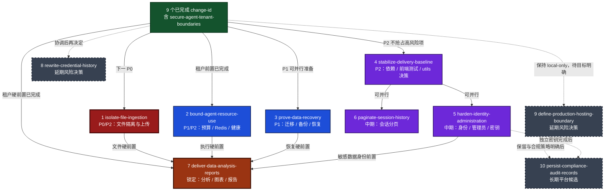

# Deep Data Agent Roadmap

> 状态日期：2026-08-17。历史审计保留 18 个 2/2 高置信度问题；当前工作树已由
> `restore-runtime-release-gates` 和 `secure-agent-tenant-boundaries` 关闭
> `AUD-014`、`AUD-011`、`AUD-015`、`AUD-001`、`AUD-003`，开放
> **13 项：1 P0 / 3 P1 / 8 P2 / 1 P3**。本文现有 9 个已完成 change-id 和
> 10 个未启动候选；生产发布仍为 **NO-GO**。新 change-id 已完成本地验收，
> 目标 SHA 的 Hosted 四个 Job 待首次实现提交推送后补录。

## 1. 使用与决策原则

- 每个候选 change-id 必须由人工明确触发，并独立转为正式 Spec；不得跨过依赖、
  进入条件或验收门槛直接实施后续候选。
- 先修复当前源码的发布阻断与验证盲区，再扩展业务能力。历史 Spec 的“已完成”
  表示当时验收完成，不替代当前 HEAD 的重新验证。
- 数据分析与报告必须同时通过租户边界、文件隔离、执行资源治理和数据恢复四条
  硬前置；任一前置失败时保持锁定。
- 真实 API Key、JWT、密码、Token、业务数据和可识别用户信息不得进入规格、
  提示词、测试固件、CI 日志或版本控制。
- 代码执行、Git 历史重写、生产数据恢复和真实模型批量调用保持人工触发，默认
  关闭；出现凭据泄露、跨租户访问、不可恢复数据变化或无法限制的资源消耗时立即
  停止对应迭代。

## 2. 已完成的 9 个 change-id

| 顺序 | change-id | 里程碑 | 主要边界 | 状态 |
| --- | --- | --- | --- | --- |
| 1 | `establish-runnable-baseline` | 建立可运行闭环 | 拆分 FastAPI/LangGraph 入口，建立五服务 Compose、缓存降级和默认关闭代码执行的基线 | 已完成 |
| 2 | `secure-user-sessions` | 第一方认证与会话隔离 | JWT、CORS、浏览器登录态及会话/消息所有权默认隔离 | 已完成 |
| 3 | `enforce-release-readiness` | 建立发布就绪治理 | 后端、前端、发布契约 Hosted CI 与本地发布检查 | 已完成 |
| 4 | `add-observability-diagnostics` | 增加可观测性与发布诊断 | 请求关联、UTC 结构化脱敏事件、有界日志和人工诊断导出 | 已完成 |
| 5 | `add-request-rate-limiting` | 增加请求限流与资源保护 | FastAPI 身份维度固定窗口限流，Redis 故障时受观测地 fail-open | 已完成 |
| 6 | `add-versioned-migrations` | 增加版本化数据库迁移 | Alembic 单 head、全新库 upgrade、旧库 stamp 与 schema 漂移测试 | 已完成 |
| 7 | `add-rbac-audit` | 增加 RBAC 与脱敏审计 | 固定 `user`/`admin` 角色、双层默认拒绝、人工管理员引导和 HMAC 身份引用 | 已完成 |
| 8 | `restore-runtime-release-gates` | 恢复运行时发布门禁 | 镜像迁移资产、全 Git 文本凭据扫描、本地五服务/迁移冒烟和 Hosted Container Smoke | 已完成（本地与 Hosted 证据） |
| 9 | `secure-agent-tenant-boundaries` | 保护 Agent 租户边界 | 第一方 JWT 贯穿 FastAPI/LangGraph，thread/run owner、租户缓存和固定浏览器 Origin | 已完成（本地证据，Hosted 待补录） |

## 3. 优先级依据

| 优先级 | 调整理由 |
| --- | --- |
| P0 近期阻塞项 | `AUD-001`、`AUD-003`、`AUD-014` 已关闭；`AUD-002` 的任意本地文件读取是当前唯一开放 P0，也是下一候选顺序的首要驱动。 |
| P1 近期阻塞项 | `AUD-004`、`AUD-007`、`AUD-008` 分别涉及生产资源失控、迁移重大不一致和 Redis 故障后保护永久降级；可在对应 P0 前置完成后并行推进。 |
| P2/P3 收敛项 | 当前开放 8 个 P2 和 1 个 P3，进入交付基线、文件治理、健康、身份及分页候选；它们不改变 P0/P1 的优先级，但其验收仍是生产放行条件。 |
| 中期业务能力 | 身份/管理员/密钥治理和会话分页有明确用户价值，但不应抢占当前发布与 Agent 隔离修复；完成后再承载更敏感、更长生命周期的数据分析工作。 |
| 长期平台候选 | Git 历史重写、生产托管边界和长期审计存储需要仓库协作、部署目标、合规周期与成本决策，当前先记录延期边界和触发条件，不伪装为已实现平台能力。 |

## 4. 迭代依赖与解锁路径

实线表示硬依赖；同一上游分叉后的节点可并行；虚线表示延期的风险/平台决策。
标记“串行阻塞”的节点必须按顺序完成，数据分析节点在全部入边通过前保持锁定。

## 5. 已完成门禁与近期阻塞项

本节编号用于文档定位，不代表执行顺序；10 个未启动候选的风险驱动顺序以第 4 节
Mermaid 节点编号为准。

### 5.1 `restore-runtime-release-gates`

- **状态**：已完成（本地与 Hosted 证据）；不再计入 10 个未启动候选。
- **结果**：恢复当前源码镜像的迁移可启动性，并让 CI 与凭据门禁能够阻止同类
  镜像缺件或凭据扫描盲区回归进入主分支。
- **映射**：`AUD-014`（P0，当前镜像运行资产不完整）、`AUD-011`（P2，CI 缺少
  镜像运行证据）、`AUD-015`（P2，凭据扫描范围存在盲区），三项均由当前工作树
  关闭。
- **本地证据**：Python 3.12.9 共 189 项测试，其中迁移定向测试 7 项；Node.js
  22.22.2、pnpm 10.5.1 前端四门禁通过。当前源码镜像的五服务、三个非业务 HTTP、
  唯一 head、head canary 和已知旧基线升级均通过，旧基线角色回填为 `user`。
- **Hosted 证据**：implementation SHA
  `30e7992fa48c350a0b0ae8a6faa12c80cfe2202d` 的 GitHub Actions run
  `31959537002` 为 `completed/success`；Backend、Frontend、Release Contracts、
  Container Smoke 四个 Job 均为 `success`，Container Smoke 的空库、head 重启、
  legacy 升级和 cleanup 均为 `success`。
- **安全与清理**：只使用专用假配置和不可外连的模型地址，未发送业务查询或调用
  外部模型/搜索；容器、网络、匿名卷、临时配置及生成物完整清理。
- **保留边界**：不关闭 `AUD-006`、`AUD-007`，不部署生产、不重写 Git 历史；
  Hosted 成功不扩大上述边界。

### 5.2 `stabilize-delivery-baseline`

- **状态**：候选，未启动；风险驱动执行顺序第 4，P2 收敛不抢占 P0/P1。
- **目标**：建立后端依赖可重复安装、关键前端工作流自动回归和 `utils/` 明确归属的
  统一交付基线。
- **映射**：`AUD-006`（P2，Python 依赖、包元数据、执行契约及镜像/Actions
  不可重复；`AUD-021` 已并入 `AUD-006`）、`AUD-020`（P2，前端缺少行为测试）、
  `DEC-005`（`utils/` 保留、拆包或退出发布边界的决策）。
- **依赖**：`restore-runtime-release-gates`。
- **进入条件**：选定 Python 锁定/哈希策略和更新工具；列出登录、连接、线程、上传
  等前端关键路径；为 `utils/` 指定业务所有者和运行时引用清单。
- **范围**：生成并验证受控 Python 依赖锁；保持 pnpm frozen lock 契约；增加不依赖
  真实外部服务的前端组件/集成测试及 CI job；形成并执行 `DEC-005`，使 `utils/`
  要么具有独立依赖、测试和安全门禁，要么明确隔离/归档且不进入发布产物。
- **非目标**：不升级所有依赖到最新版；不重写 `utils/` 的全部外部集成；不以快照
  测试替代租户、文件和认证行为测试。
- **验收门槛**：同一锁文件在干净环境和镜像中两次安装得到一致解析结果；依赖更新
  由显式命令和 diff 驱动；前端关键成功/失败路径可重复通过且无网络泄漏；CI 对
  缺锁、锁漂移和测试失败均 fail-closed；`utils/` 决策、所有者、扫描范围和退出
  条件写入正式 Spec。
- **停止条件**：锁定过程需要不可审计私有源、前端测试出现无法收敛的非确定性，
  或 `utils/` 无所有者却仍被要求进入运行镜像时停止。

### 5.3 `secure-agent-tenant-boundaries`

- **状态**：已完成本地验收；目标 SHA 的 Hosted 四个 Job 待推送后补录，不再计入
  10 个未启动候选。
- **目标**：让第一方身份贯穿 FastAPI Agent 入口、LangGraph run/thread、缓存和
  浏览器连接，阻止匿名调用、跨租户线程访问及 Key 被发送到非信任地址。
- **映射**：`AUD-001`（P0，Agent/LangGraph 多租户边界缺失）、`AUD-003`
  （P0，浏览器 LangGraph 地址与 API Key 信任边界不足）、`DEC-001`（MySQL 会话消息与
  LangGraph threads 的对话主数据源决策）、`DEC-002`（同源代理、自定义认证或
  独立网关的 LangGraph 入口决策）。
- **依赖**：`restore-runtime-release-gates`；既有认证、RBAC、限流和请求关联能力。
- **决策**：`DEC-001` 已选择 LangGraph threads 为 Chat UI 对话主数据、MySQL
  users/RBAC 为身份主数据且不双写；`DEC-002` 已选择当前版本自定义 Auth，不新增
  FastAPI 流式代理。
- **结果**：第一方 JWT 同时保护 FastAPI `/api/query` 与 LangGraph；thread/run
  owner 由服务端覆盖并过滤，管理员不绕过；Agent 缓存按用户、模型和工具策略
  隔离；前端只连接构建配置，删除旧 LangGraph API Key 读写。
- **本地证据**：Python 3.12.9 下 250 项测试；Node 22/pnpm 10.5.1 的 typecheck、
  零警告 lint、format:check；五服务空库双用户、head 重启和 legacy 升级三场景
  通过。双用户场景覆盖固定 assistant、并发重复搜索、history/state/copy/读改删/
  create_run、管理员不绕过和无 MySQL 双写；全程未调用模型或搜索。
- **依赖风险**：容器中的 `langgraph-api 0.7.28` 已 EOL，升级与兼容回归归入
  `AUD-006`/`stabilize-delivery-baseline`。
- **非目标**：不引入组织层级、自定义角色、计费、多区域租户或第三方 SSO；不在
  本轮开放数据分析。
- **验收门槛**：匿名 Agent 请求稳定拒绝；两个用户不能搜索、读取、继续、删除或
  复用对方 thread/run/cache；管理员默认也不能绕过所有权；恶意 `apiUrl`、查询
  参数、重定向和 origin 不能接收 Key；并发及重试测试不混淆租户，日志不记录
  principal 原文、Key 或消息正文。
- **停止条件**：任何跨租户读写、Key 外发、无法归属的历史 thread，或为兼容旧
  客户端而保留匿名旁路时停止，后续文件与执行迭代不得开始。

### 5.4 `isolate-file-ingestion`

- **状态**：候选，未启动；风险驱动执行顺序第 1，租户边界后的 P0/P2 项。
- **目标**：以租户所有的受管理上传替代任意本地路径读取，并对文件类型、大小、
  生命周期和解析行为实施服务端限制。
- **映射**：`AUD-002`（P0，文档工具可读取任意可见路径）、`AUD-005`（P2，上传
  仅有客户端类型检查且缺少大小边界）、`DEC-004`（禁用路径工具或建设受管理上传
  的决策）。
- **依赖**：`secure-agent-tenant-boundaries`；可与
  `bound-agent-resource-use` 并行。
- **进入条件**：正式批准 `DEC-004`。推荐选择受管理上传；若未批准，则保持
  `analyze_document` 不注册并继续锁定数据分析。定义允许格式、单文件/租户配额、
  保留期、删除语义和恶意样本集。
- **范围**：认证上传接口；服务端 MIME/魔数/扩展名联合校验；随机化租户目录或
  对象键；规范化路径和所有权检查；解析进程资源限制；临时文件清理；公式注入、
  压缩炸弹、路径穿越和重复上传测试；文件来源/版本的脱敏引用。
- **非目标**：不读取用户提供的服务器绝对路径；不支持任意文件格式、永久文档库、
  OCR/病毒平台或跨租户共享；不自动把真实业务文件发送给模型。
- **验收门槛**：越权文件 ID、路径穿越、符号链接、伪造 MIME、超限文件、压缩炸弹
  和公式注入均 fail-closed；两个租户的上传、解析、删除和产物完全隔离；中断/
  超时后临时文件可回收；禁用解析器时原文件仍不可被 Agent 直接读取；测试与日志
  只使用脱敏样本。
- **停止条件**：解析器需要宿主机任意文件权限、文件无法关联租户、删除无法覆盖
  派生产物，或任一恶意样本造成进程失控时停止。

### 5.5 `bound-agent-resource-use`

- **状态**：候选，未启动；风险驱动执行顺序第 2，租户边界后的 P1/P2 项。
- **目标**：为 Agent、模型与工具建立端到端预算，恢复 Redis 故障后的受控行为，
  并让健康端点反映真实的存活/就绪状态。
- **映射**：`AUD-004`（P1，Agent/工具缺少完整执行预算）、`AUD-008`（P1，Redis
  故障后降级与恢复边界不足）、`AUD-009`（P2，健康检查不反映关键依赖/配置）、
  `RR-004`（Python 执行默认关闭但启用后无沙箱）、`RR-006`（Redis 故障时
  fail-open 的生产策略）。
- **依赖**：`secure-agent-tenant-boundaries`；可与 `isolate-file-ingestion` 和
  `prove-data-recovery` 并行。
- **进入条件**：按请求和租户定义 wall time、模型轮次/token、工具调用、并发、
  输出和缓存配额；定义 Redis fail-open/fail-closed 矩阵；区分 liveness 与
  readiness。
- **范围**：Agent 递归/步骤/超时/取消预算；模型与搜索调用预算；工具子进程的
  CPU、内存、网络、文件系统和输出上限；代码执行在沙箱达标前保持关闭；Redis
  重连/退避和降级告警；数据库、Redis、配置及 Agent 可用性的分层健康语义。
- **非目标**：不建设通用容器编排平台、分布式调度器、自动封禁系统或无限重试；
  不因存在 30 秒子进程超时就宣称代码执行已沙箱化。
- **验收门槛**：超预算请求可取消且返回稳定错误/关联 ID；并发用户预算互不挤占；
  子进程不能访问宿主敏感路径或外网，未满足时工具保持未注册；Redis 断开后按策略
  降级并能自动恢复，限流降级可观测；liveness 不误杀、readiness 在关键依赖失效
  时失败；故障注入不泄露输入。
- **停止条件**：取消后任务仍消耗资源、Redis 降级造成无限制高成本调用、健康检查
  会触发真实模型，或沙箱边界无法用攻击测试证明时停止。

### 5.6 `prove-data-recovery`

- **状态**：候选，未启动；风险驱动执行顺序第 3，近期 P1 并行项。
- **目标**：在真实 MySQL 契约上证明迁移前备份、失败恢复和恢复后数据一致性，而
  不再只依赖 SQLite schema 测试与自动 stamp 假设。
- **映射**：`AUD-007`（P1，迁移/stamp 缺少生产等价保护和恢复证据）、`RR-001`
  （备份恢复流程尚未验证）。
- **依赖**：`restore-runtime-release-gates`；专用非生产 MySQL 数据集和受控备份
  位置。
- **进入条件**：定义 RPO/RTO、备份格式、校验和、加密/访问控制、保留期；准备
  全新库、当前 head、旧版未跟踪库和故意漂移库四类脱敏样本。
- **范围**：迁移前强制备份/快照门禁；旧库 schema 指纹匹配后才允许 stamp；
  MySQL upgrade、失败回滚或前向修复；备份恢复演练；业务行数、外键、唯一约束、
  角色和会话/消息关联校验；恢复 runbook 和证据模板。
- **非目标**：不读取生产数据；不建设跨地域容灾、持续复制或零停机迁移平台；
  不承诺未经演练的 downgrade 可恢复全部业务语义。
- **验收门槛**：四类样本按预期通过或安全拒绝；无匹配备份时迁移 fail-closed；
  故意中断后可在 RPO/RTO 内恢复，校验和与业务不变量一致；恢复证据包含版本和
  时间但不含业务内容；演练命令可由另一维护者按 runbook 重复。
- **停止条件**：备份不可独立恢复、stamp 会接受未知 schema、迁移步骤不可逆却无
  前向修复方案，或测试可能连接生产地址时停止。

## 6. 中期业务能力

### 6.1 `harden-identity-administration`

- **状态**：候选，未启动；风险驱动执行顺序第 5，必须在数据分析前完成。
- **目标**：补齐管理员连续性、密码输入边界和用途分离的身份摘要密钥管理，使审计
  与限流身份引用不依赖共用密钥或可枚举的无密钥摘要。
- **映射**：`AUD-012`（P2，审计身份引用与 JWT 签名共用密钥）、`AUD-016`
  （P2，管理员连续性/角色变更不变量不足）、`AUD-017`（P2，密码输入与哈希边界
  不足）、`AUD-018`（P3，限流使用无密钥 SHA-256 截断低熵用户 ID/IP，摘要可
  枚举反查）。
- **依赖**：`stabilize-delivery-baseline`；既有 RBAC、迁移和脱敏审计。
- **进入条件**：批准 JWT 签名、审计 HMAC 和限流身份摘要各自独立的密钥用途；
  定义密钥版本、轮换和恢复流程；定义至少一名管理员和密码字节上限。
- **范围**：独立且版本化的审计引用密钥与限流摘要密钥；使用域分离 HMAC 生成
  限流 Redis 键和诊断摘要并限制访问；bcrypt 前的长度/编码验证；禁止移除最后
  一名有效管理员；管理员引导与角色变化审计。
- **非目标**：不建设自定义 RBAC、管理员前端、OAuth/SSO、密码找回或完整 IAM
  平台；不把 `AUD-018` 解释为 Token/会话撤销；不把原始用户 ID/IP 写入日志。
- **验收门槛**：已知用户 ID/IP 在无密钥时不能复算限流键；限流密钥轮换和窗口
  行为有确定性测试；JWT、审计和限流密钥不可互用，JWT 轮换不改变审计引用；
  超长/多字节密码稳定拒绝而非 500；并发角色变更不能产生零管理员；日志、错误和
  诊断不输出原始身份或可逆映射。
- **停止条件**：需要把密钥写入仓库/镜像、审计或限流摘要复用 JWT 密钥、限流密钥
  轮换破坏窗口隔离，或管理员不变量无法在数据库事务中保证时停止。

### 6.2 `paginate-session-history`

- **状态**：候选，未启动；风险驱动执行顺序第 6，中期可并行项。
- **目标**：为会话列表和消息历史建立有界、稳定且保持所有权过滤的分页契约。
- **映射**：`AUD-010`（P2，第一方会话/消息与前端线程历史缺少完整分页）；原
  `AUD-013`（前端线程分页）作为同一分页根因合并到 `AUD-010`，统一归属本迭代。
- **依赖**：`stabilize-delivery-baseline`；既有会话所有权测试。
- **进入条件**：选择 cursor 或等价稳定分页模型；定义默认/最大页大小、排序键、
  游标失效和前端加载语义。
- **范围**：会话、消息与统一主数据契约下的线程分页 API、稳定复合排序/索引、
  租户过滤、前端增量加载、并发插入/删除测试、响应大小和查询耗时观测。
- **非目标**：不增加全文搜索、归档、跨会话分析、跨用户共享或无限滚动预取。
- **验收门槛**：默认与最大页大小强制生效；大数据集下无全量响应；并发写入时无
  越权、重复或不可解释漏项；伪造/过期游标稳定拒绝；查询计划使用预期索引，前端
  可恢复加载失败。
- **停止条件**：分页会弱化 `user_id` 过滤、游标包含可识别信息、查询仍随用户
  全部历史线性加载，或旧客户端兼容要求恢复无界接口时停止。

### 6.3 `deliver-data-analysis-reports`

- **状态**：候选，未启动且保持锁定；风险驱动执行顺序第 7，不是当前已实现能力。
- **目标**：在受管理文件和有界执行基础上交付可追溯的数据导入、分析、图表与报告
  闭环。
- **映射**：产品能力候选，无新增 `AUD`、`RR` 或 `DEC`；只消费前置迭代的验收
  结果，不改变第 8、9 节记录的问题与风险归属。
- **依赖**：`secure-agent-tenant-boundaries`、`isolate-file-ingestion`、
  `bound-agent-resource-use`、`prove-data-recovery` 和
  `harden-identity-administration` 全部完成；`stabilize-delivery-baseline`
  持续通过。
- **进入条件**：上述依赖均有正式 Spec 验收证据；`DEC-004` 已选择受管理上传；
  定义支持格式、schema、租户配额、保留/删除、来源版本、图表和报告导出契约。
- **范围**：脱敏专用数据导入；schema/公式/内容验证；有界统计分析；受控图表；
  报告生成、版本和来源追踪；租户内历史与删除；失败恢复和人工导出。
- **非目标**：不使用生产数据作默认验证；不开放任意 Python、任意 SQL、宿主文件
  路径或自动外发；不承诺 BI 平台、实时流处理、跨租户共享或模型生成结果正确性。
- **验收门槛**：上传到报告全链路使用专用脱敏数据通过；文件、租户、模型、工具、
  时间、内存、并发和输出配额均 fail-closed；每个结论可追溯到文件版本、分析版本
  和请求 ID；删除覆盖原始与派生产物；代码执行在沙箱证据缺失时保持关闭；恢复
  演练能恢复报告元数据且不串租户。
- **停止条件**：任何硬前置回归、跨租户可见、来源不可追溯、公式/内容注入、资源
  超限后无法取消、恢复不完整，或验收需要未经授权的真实业务数据时停止。

## 7. 长期平台候选与延期决策

### 7.1 `rewrite-credential-history`

- **状态**：长期候选，延期；风险驱动执行顺序第 8，普通业务迭代不得自动触发。
- **目标**：在协作者和镜像引用可控时，决定并执行历史敏感值清理，或由风险所有者
  正式接受保留历史的残余风险。
- **映射**：`RR-002`（已轮换凭据仍存在于 Git 历史）。
- **依赖**：`restore-runtime-release-gates`；全部相关凭据已轮换失效；仓库所有者、
  协作者和下游镜像清单完整。
- **进入条件**：干净工作区；冻结写入窗口；备份 refs；批准 force-push、签名、
  fork/clone、发布制品和协作者重新同步方案。
- **范围**：历史扫描、受影响 refs/制品盘点、轮换复核、演练仓库、人工确认后的
  历史重写、镜像/缓存清理和重写后扫描；若不重写则形成有期限的风险接受记录。
- **非目标**：不在无人值守 Agent 中执行；不把历史重写与功能开发混合；不把
  “当前分支扫描通过”等同于历史已清理。
- **验收门槛**：重写路径需证明所有目标 refs 不再命中且协作者恢复完成；接受风险
  路径需记录所有者、理由、影响范围、补偿控制、复审日期和触发清理的事件。
- **停止条件**：存在未轮换凭据、未知受保护 refs/镜像、未提交工作、关键协作者
  未确认或无法回滚引用时停止。

### 7.2 `define-production-hosting-boundary`

- **状态**：长期候选，延期；风险驱动执行顺序第 9。当前只声明 local-only/受控
  网络能力，不声明生产托管就绪。
- **目标**：决定项目继续保持 local-only，还是建立受支持的生产托管安全与运维
  边界。
- **映射**：`RR-003`（local-only 假设尚未形成可强制的部署边界）、`DEC-003`
  （严格 local-only 或网络化多用户部署的决策）。
- **依赖**：`restore-runtime-release-gates`；明确的产品所有者、部署目标、数据
  分类和可用性目标。
- **进入条件**：给出公网/内网、本地/云、单租户/多租户选择；指定域名、TLS、
  反向代理、Secret Store、持久卷、备份、SLO 和值班所有者。
- **范围**：部署威胁模型；网络暴露、可信代理、CORS、TLS、Secret、镜像来源、
  持久化、监控和升级边界；若保持 local-only，则增加可验证的绑定/防误暴露门禁
  和支持声明。
- **非目标**：不在部署目标未定时购买平台或公开端口；不承诺多区域、高可用或
  合规认证。
- **验收门槛**：local-only 路径需自动阻止非批准网络暴露并明确支持边界；生产
  路径需形成独立可验收 Spec、威胁模型、运维所有者和发布/回滚证据清单。
- **停止条件**：无数据分类、Secret 管理、TLS 终止、备份责任或值班所有者时停止
  生产化，并维持 local-only 声明。

### 7.3 `persist-compliance-audit-records`

- **状态**：长期平台候选，延期；风险驱动执行顺序第 10。当前有界本地日志不等于
  长期或不可变审计存储。
- **目标**：仅在合规与保留要求明确后，引入访问受控、可验证完整性且成本有界的
  长期审计记录。
- **映射**：`RR-005`（审计事件仅保存在有界本地/容器日志）。
- **依赖**：`define-production-hosting-boundary`、
  `harden-identity-administration`；批准的数据分类、保留、删除和调查流程。
- **进入条件**：定义事件白名单、保留期、驻留区域、访问角色、完整性模型、密钥
  托管、成本上限和法律删除例外。
- **范围**：审计事件可靠投递、缓冲/背压、不可篡改或可验证完整性存储、查询与
  导出授权、保留/删除、访问审计、灾难恢复及脱敏验证。
- **非目标**：不保存提示词、消息正文、Token、原始身份或任意应用日志；不把审计
  存储扩展成通用数据湖或自动外发系统。
- **验收门槛**：允许事件在故障和重放下不静默丢失且不重复改变语义；未授权查询
  被拒绝并被审计；保留/删除和恢复演练通过；完整性可独立验证；成本与容量告警
  有明确所有者。
- **停止条件**：无法证明身份脱敏、访问最小化、密钥隔离、驻留/删除合规或故障
  背压不会阻断核心服务时停止，并继续使用当前有界本地基线。

## 8. 审计问题状态与 Roadmap 唯一映射

### 8.1 当前工作树已关闭

| 审计 ID | Spec 最终 severity | 完成 change-id | 当前状态 |
| --- | --- | --- | --- |
| `AUD-014` | `P0` | `restore-runtime-release-gates` | 镜像迁移资产及空库/head/已知旧基线本地容器证据通过，已关闭 |
| `AUD-011` | `P2` | `restore-runtime-release-gates` | Container Smoke 工作流、本地五服务及 Hosted run `31959537002` 证据完成，已关闭 |
| `AUD-015` | `P2` | `restore-runtime-release-gates` | Git 跟踪及非忽略待提交文本扫描、二进制与脱敏测试通过，已关闭 |
| `AUD-001` | `P0` | `secure-agent-tenant-boundaries` | FastAPI/LangGraph 第一方身份、thread/run owner 与租户缓存已由双用户容器实证关闭 |
| `AUD-003` | `P0` | `secure-agent-tenant-boundaries` | 前端固定 Agent Origin、移除持久化 API Key 并增加发布契约，已关闭 |

### 8.2 当前开放 13 项

| 审计 ID | Spec 最终 severity | Roadmap change-id | 处置 |
| --- | --- | --- | --- |
| `AUD-002` | `P0` | `isolate-file-ingestion` | 取消任意路径读取，改为租户受管理文件 |
| `AUD-004` | `P1` | `bound-agent-resource-use` | 增加端到端执行、调用、临时资源与输出预算 |
| `AUD-007` | `P1` | `prove-data-recovery` | 用 MySQL 证明迁移保护、备份和恢复 |
| `AUD-008` | `P1` | `bound-agent-resource-use` | 明确 Redis 降级、重连和限流恢复语义 |
| `AUD-006` | `P2` | `stabilize-delivery-baseline` | 锁定 Python 依赖、包元数据、执行契约及镜像/Actions；`AUD-021` 已并入 `AUD-006` |
| `AUD-020` | `P2` | `stabilize-delivery-baseline` | 增加前端关键工作流行为测试 |
| `AUD-005` | `P2` | `isolate-file-ingestion` | 增加服务端文件类型、大小、配额与生命周期限制 |
| `AUD-009` | `P2` | `bound-agent-resource-use` | 拆分存活/就绪并覆盖关键依赖与配置 |
| `AUD-017` | `P2` | `harden-identity-administration` | 收紧密码字节、编码和哈希错误边界 |
| `AUD-016` | `P2` | `harden-identity-administration` | 保证管理员连续性和角色变更不变量 |
| `AUD-012` | `P2` | `harden-identity-administration` | 分离 JWT 签名与审计身份引用密钥 |
| `AUD-010` | `P2` | `paginate-session-history` | 为会话、消息与前端线程增加完整分页；原 `AUD-013` 作为同一分页根因合并到 `AUD-010` |
| `AUD-018` | `P3` | `harden-identity-administration` | 以独立可轮换 HMAC 替代可枚举的低熵限流 SHA-256 摘要 |

原 `AUD-013`（前端线程分页）作为同一分页根因合并到 `AUD-010`，统一归属
`paginate-session-history`；`AUD-021` 已并入 `AUD-006`，二者不重复计数。仅
`AUD-019` 经双重验证为 0/2 并排除，不创建 Roadmap 工作。第 8.1 节 5 项与第
8.2 节 13 项共同保留历史 18 项的唯一映射；当前开放统计为
**1 P0 / 3 P1 / 8 P2 / 1 P3**。

## 9. 剩余风险与开放决策映射

| ID | Roadmap change-id | 当前处置与解锁条件 |
| --- | --- | --- |
| `RR-001` | `prove-data-recovery` | 近期处理；恢复演练通过前不允许数据分析承载持久业务数据 |
| `RR-002` | `rewrite-credential-history` | 延期；当前只依赖已轮换凭据与现树门禁，外部公开/合规要求出现时必须重写或由风险所有者限期接受 |
| `RR-003` | `define-production-hosting-boundary` | 延期；维持 local-only/受控网络声明，任何公网或正式生产部署先触发本迭代 |
| `RR-004` | `bound-agent-resource-use` | 近期处理；Python 执行默认关闭，任何环境启用前必须永久禁用或迁入无凭据、无宿主挂载的隔离执行器 |
| `RR-005` | `persist-compliance-audit-records` | 延期；当前有界日志只支持本地诊断，出现长期保留/合规要求时不得以现状冒充满足 |
| `RR-006` | `bound-agent-resource-use` | 近期处理；为 Redis 故障下的限流 fail-open/fail-closed 制定生产策略，并与 `AUD-008` 自动恢复联动 |
| `DEC-003` | `define-production-hosting-boundary` | 决定保持严格 local-only 或支持网络化多用户部署；后者须先补齐网络、TLS、密钥、备份与监控边界 |
| `DEC-004` | `isolate-file-ingestion` | 进入迭代前决定“受管理上传”或“禁用文件工具”；未决时采用禁用并阻塞数据分析 |
| `DEC-005` | `stabilize-delivery-baseline` | 进入迭代时决定 `utils/` 独立治理或隔离/归档；无所有者时不得进入运行镜像 |

## 10. 全局停止与调整规则

- 任一迭代发现真实凭据、跨租户访问、未经授权的文件/数据读取、不可恢复数据变化、
  无法取消的高成本执行或敏感日志外发时，立即停止并回到已建立的发布门禁或对应
  安全前置。
- 任一硬依赖回归都会重新锁定 `deliver-data-analysis-reports`；不得以风险接受
  绕过租户、文件、执行或恢复四条前置。
- 优先级、依赖、范围或风险接受发生变化时，必须同步正式 Spec、Roadmap 和变更
  记录；不得只通过实现代码或自动化 Agent 隐式改变。
- 候选验收必须使用脱敏、专用测试数据。生产数据、历史重写和真实外部服务验证只
  能由授权人员人工触发，并保留不含敏感原文的证据。
